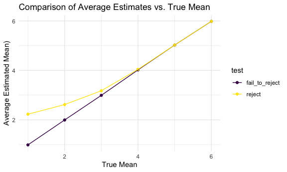

p8105_hw5_ah4167
================
Aiying Huang
2023-11-04

``` r
# Load necessary libraries
library(tidyverse)
library(rvest)
```

    ## 
    ## Attaching package: 'rvest'

    ## The following object is masked from 'package:readr':
    ## 
    ##     guess_encoding

``` r
library(purrr)
```

# problem1

``` r
homicide_data <- read_csv("./data/raw.githubusercontent.com_washingtonpost_data-homicides_master_homicide-data.csv")
```

    ## Rows: 52179 Columns: 12
    ## ── Column specification ────────────────────────────────────────────────────────
    ## Delimiter: ","
    ## chr (9): uid, victim_last, victim_first, victim_race, victim_age, victim_sex...
    ## dbl (3): reported_date, lat, lon
    ## 
    ## ℹ Use `spec()` to retrieve the full column specification for this data.
    ## ℹ Specify the column types or set `show_col_types = FALSE` to quiet this message.

The raw data has 52179 entries and 12 total columns, representing 52179
cases of homicide and the victims’ information.

``` r
# Create a city_state variable and summarize the data
homicide_summary =
  homicide_data |>
  mutate(city_state = paste(city, state, sep = ", ")) |>
  group_by(city_state) |>
  summarize(
    total_homicides = n(),
    unsolved_homicides = sum(disposition %in% c("Closed without arrest", "Open/No arrest"))
  )
```

``` r
# Estimate the proportion for Baltimore, MD
baltimore_data = homicide_summary|>
  filter(city_state == "Baltimore, MD")

baltimore_prop_test = prop.test(baltimore_data$unsolved_homicides, baltimore_data$total_homicides)

# Save the output and use broom::tidy to tidy the data
baltimore_tidy = broom::tidy(baltimore_prop_test)

# Extract the estimated proportion and confidence intervals
baltimore_estimate = baltimore_tidy |>
  select(estimate, conf.low, conf.high)
```

The estimated unsolved_homicides proportion for Baltimore is 0.65, and
the confidence intervals is (0.63,0.66).

``` r
# Function to run prop.test and tidy results for each city
prop_test_per_city = function(total, unsolved) {
  test_result = prop.test(unsolved, total)
  broom::tidy(test_result)
}

# Apply the function to each city and create a tidy dataframe
city_estimates = homicide_summary |>
  mutate(
    prop_test_results = map2(
      total_homicides, unsolved_homicides, prop_test_per_city)) |>
  unnest(prop_test_results) |>
  select(city_state, estimate, conf.low, conf.high)
city_estimates|>
  head(10)
```

    ## # A tibble: 10 × 4
    ##    city_state      estimate conf.low conf.high
    ##    <chr>              <dbl>    <dbl>     <dbl>
    ##  1 Albuquerque, NM    0.386    0.337     0.438
    ##  2 Atlanta, GA        0.383    0.353     0.415
    ##  3 Baltimore, MD      0.646    0.628     0.663
    ##  4 Baton Rouge, LA    0.462    0.414     0.511
    ##  5 Birmingham, AL     0.434    0.399     0.469
    ##  6 Boston, MA         0.505    0.465     0.545
    ##  7 Buffalo, NY        0.612    0.569     0.654
    ##  8 Charlotte, NC      0.300    0.266     0.336
    ##  9 Chicago, IL        0.736    0.724     0.747
    ## 10 Cincinnati, OH     0.445    0.408     0.483

``` r
# Create a plot with error bars for each city
city_estimates|>
  ggplot(aes(x = reorder(city_state, -estimate), y = estimate)) +
  geom_point() +
  geom_errorbar(aes(ymin = conf.low, ymax = conf.high), width = 0.2) +
  coord_flip() +  # Flipping coordinates for horizontal bars
  labs(
    x = "City",
    y = "Proportion of Unsolved Homicides",
    title = "Proportion of Unsolved Homicides in US Cities"
  ) +
  theme_minimal()
```


We can see from the plota above, Chicago, IL is the city solving fewest
homicides while Tulsa, AL is the city solving most homicides.

# Problem2

``` r
# Create a dataframe containing all file names
file_paths <- list.files(path = "./data/hw5_data", full.names = TRUE, pattern = "\\.csv$")
```

``` r
# Iterate over file names and read in data
df=
  expand_grid(
    names=file_paths
  )|>
  mutate(result=map(names,read.csv))|>
  mutate(
    names=str_replace(names, "./data/hw5_data/", "")
    )
```

``` r
# Tidy the result
tidy_data =
  df |>
  mutate(
    subject_ID = str_extract(names,"\\d+"), # Extracts numbers from the filename
    arm = if_else(str_detect(names, "con"), "control", "experimental"),
    names = NULL # Remove the file_name column, no longer needed
  ) |>
  select(subject_ID,arm,result)|>
  unnest(result)|>
  tidyr::pivot_longer(
    week_1:week_8,
    names_to="week",
    values_to="observation"
  )|>
  mutate(week=as.numeric(str_extract(week,"\\d+")))
```

``` r
# Make a spaghetti plot
tidy_data|>
  group_by(subject_ID)|>
  ggplot(
    aes(x=week,y=observation,color=subject_ID)
  )+
  geom_line()+
  facet_wrap(~arm)+
  labs(
    title = "Observations Over Time by Subject",
    x = "Week",
    y = "Observation",
    color = "subject"
  )
```


We can see from the spaghetti plots above that the values of
observations in the experimental group increased over time, while they
remained relatively stable around their initial values in the control
group.

# Problem3

``` r
# Set parameters
n = 30 # Sample size
sigma = 5 # Standard deviation
mu = 0 # Population mean
alpha = 0.05 # Significance level
num_datasets = 5000 # Number of datasets

# Function to perform t-test on a single dataset
perform_t_test = function(mu=0, n=30, sigma=5) {
  sample_data = rnorm(n, mean = mu, sd = sigma)
  test_result = t.test(sample_data, mu = 0)
  broom::tidy(test_result)
}

# Simulate datasets and perform t-tests
simulated_tests = 
  replicate(
    num_datasets, 
    perform_t_test(mu, n, sigma), 
    simplify = FALSE)
simulated_tests_df =bind_rows(simulated_tests)

# Add identification for each simulation
simulated_tests_df = 
  simulated_tests_df |>
  mutate(simulation = row_number())

# Display a summary of the simulation results
head(simulated_tests_df)
```

    ## # A tibble: 6 × 9
    ##   estimate statistic p.value parameter conf.low conf.high method     alternative
    ##      <dbl>     <dbl>   <dbl>     <dbl>    <dbl>     <dbl> <chr>      <chr>      
    ## 1   1.60       1.69    0.102        29   -0.339      3.54 One Sampl… two.sided  
    ## 2   0.921      0.809   0.425        29   -1.41       3.25 One Sampl… two.sided  
    ## 3  -0.218     -0.293   0.771        29   -1.74       1.30 One Sampl… two.sided  
    ## 4  -0.0922    -0.122   0.904        29   -1.64       1.46 One Sampl… two.sided  
    ## 5   1.28       1.18    0.247        29   -0.935      3.49 One Sampl… two.sided  
    ## 6  -0.424     -0.442   0.662        29   -2.39       1.54 One Sampl… two.sided  
    ## # ℹ 1 more variable: simulation <int>

``` r
# Set parameters
n = 30 # Sample size
sigma = 5 # Standard deviation
mu_values = 1:6
alpha = 0.05 # Significance level
num_datasets = 5000 # Number of datasets

# Function to perform t-test on a single dataset
perform_t_test = function(mu, n=30, sigma=5) {
  sample_data = rnorm(n, mean = mu, sd = sigma)
  test_result = t.test(sample_data, mu = 0)
  broom::tidy(test_result)
}

# Run simulation for multiple values of mu
simulation_results=
  map(mu_values, 
      function(mu) {
        t_tests = replicate(num_datasets, perform_t_test(mu, n, sigma), simplify = FALSE)
        t_tests_df = bind_rows(t_tests) |>
          add_column(mu = mu, .before = 1) |>
          mutate(rejected = p.value < alpha)
        t_tests_df
}) |> 
  bind_rows()

# Calculate the power for each value of mu
power_df =
  simulation_results |> 
  group_by(mu) |>
  summarise(power = mean(rejected))

# Calculate the average estimate of mu_hat
mu_hat_df =
  simulation_results |>
  group_by(mu) |>
  summarise(avg_mu_hat = mean(estimate))

# Calculate the average estimate of mu_hat where the null was rejected
mu_hat_rejected_df =
  simulation_results |> 
  filter(rejected) |>
  group_by(mu) |>
  summarise(avg_mu_hat_rejected = mean(estimate))
```

``` r
# Plot the power vs. true value of mu
ggplot(power_df, aes(x = mu, y = power)) +
  geom_point() +
  geom_line() +
  labs(x = "True Mean (mu)", y = "Power", title = "Power vs. True Mean")
```


The first plot shows the power of the test across different true means,
we can see that power increases with the true mean because larger effect
sizes are easier to detect.

``` r
combined_estimates <- left_join(mu_hat_df, mu_hat_rejected_df, by = "mu")
# Plot the power vs. true value of mu
combined_estimates|>
  pivot_longer(
    avg_mu_hat:avg_mu_hat_rejected,
    names_to="test",
    values_to="avg_mu"
  )|>
  mutate(
    test=case_match(
      test,
      "avg_mu_hat"~"fail_to_reject",
      "avg_mu_hat_rejected"~"reject"
    )
  )|>
  group_by(mu)|>
  ggplot(aes(x = mu,y=avg_mu,color=test)) +
  geom_point()+
  geom_line() +
  labs(x = "True Mean", y = "Average Estimated Mean)",
       title = "Comparison of Average Estimates vs. True Mean") +
  theme_minimal()
```



The second plot shows the average estimated mean versus the true mean,
with an overlay of the average estimated mean when the null hypothesis
was rejected. We observed that the average estimated mean is biased
upwards when considering only those tests where the null was rejected, a
phenomenon known as “winner’s curse” in statistics, where estimates
following a significant result tend to overestimate the true effect size
due to the selection of only significant outcomes.
