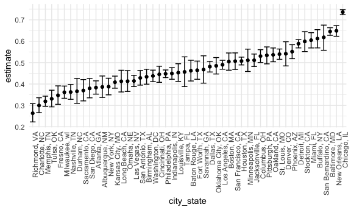

p8105_hw5_ah4167
================
Aiying Huang
2023-11-04

``` r
# Load necessary libraries
library(tidyverse)
library(rvest)
```

    ## 
    ## Attaching package: 'rvest'

    ## The following object is masked from 'package:readr':
    ## 
    ##     guess_encoding

``` r
library(purrr)
```

# problem1

``` r
homicide_data <- read_csv("./data/raw.githubusercontent.com_washingtonpost_data-homicides_master_homicide-data.csv")
```

    ## Rows: 52179 Columns: 12
    ## ── Column specification ────────────────────────────────────────────────────────
    ## Delimiter: ","
    ## chr (9): uid, victim_last, victim_first, victim_race, victim_age, victim_sex...
    ## dbl (3): reported_date, lat, lon
    ## 
    ## ℹ Use `spec()` to retrieve the full column specification for this data.
    ## ℹ Specify the column types or set `show_col_types = FALSE` to quiet this message.

The raw data has 52179 entries and 12 total columns, representing 52179
cases of homicide and the victims’ information.

``` r
# Create a city_state variable and summarize the data
homicide_summary =
  homicide_data |>
  mutate(city_state = paste(city, state, sep = ", ")) |>
  group_by(city_state) |>
  summarize(
    total_homicides = n(),
    unsolved_homicides = sum(disposition %in% c("Closed without arrest", "Open/No arrest"))
  )
```

``` r
# Estimate the proportion for Baltimore, MD
baltimore_data = homicide_summary|>
  filter(city_state == "Baltimore, MD")

baltimore_prop_test = prop.test(baltimore_data$unsolved_homicides, baltimore_data$total_homicides)

# Save the output and use broom::tidy to tidy the data
baltimore_tidy = broom::tidy(baltimore_prop_test)

# Extract the estimated proportion and confidence intervals
baltimore_estimate = baltimore_tidy |>
  select(estimate, conf.low, conf.high)
```

The estimated unsolved_homicides proportion for Baltimore is 0.6455607,
and the confidence intervals is (0.6275625,0.6631599).

``` r
# Function to run prop.test and tidy results for each city
prop_test_per_city = function(total, unsolved) {
  test_result = prop.test(unsolved, total)
  broom::tidy(test_result)
}

# Apply the function to each city and create a tidy dataframe
city_estimates = homicide_summary |>
  mutate(
    prop_test_results = map2(
      total_homicides, unsolved_homicides, prop_test_per_city)) |>
  unnest(prop_test_results) |>
  select(city_state, estimate, conf.low, conf.high)
city_estimates|>
  head(10)
```

    ## # A tibble: 10 × 4
    ##    city_state      estimate conf.low conf.high
    ##    <chr>              <dbl>    <dbl>     <dbl>
    ##  1 Albuquerque, NM    0.386    0.337     0.438
    ##  2 Atlanta, GA        0.383    0.353     0.415
    ##  3 Baltimore, MD      0.646    0.628     0.663
    ##  4 Baton Rouge, LA    0.462    0.414     0.511
    ##  5 Birmingham, AL     0.434    0.399     0.469
    ##  6 Boston, MA         0.505    0.465     0.545
    ##  7 Buffalo, NY        0.612    0.569     0.654
    ##  8 Charlotte, NC      0.300    0.266     0.336
    ##  9 Chicago, IL        0.736    0.724     0.747
    ## 10 Cincinnati, OH     0.445    0.408     0.483

``` r
# Create a plot with error bars for each city
city_estimates|>
  ggplot(aes(x = reorder(city_state, -estimate), y = estimate)) +
  geom_point() +
  geom_errorbar(aes(ymin = conf.low, ymax = conf.high), width = 0.2) +
  coord_flip() +  # Flipping coordinates for horizontal bars
  labs(
    x = "City",
    y = "Proportion of Unsolved Homicides",
    title = "Proportion of Unsolved Homicides in US Cities"
  ) +
  theme_minimal()
```


We can see from the plota above, Chicago, IL is the city solving fewest
homicides while Tulsa, AL is the city solving most homicides.

# Problem2

``` r
# Create a dataframe containing all file names
file_paths <- list.files(path = "./data/hw5_data", full.names = TRUE, pattern = "\\.csv$")
```

``` r
# Iterate over file names and read in data
df=
  expand_grid(
    names=file_paths
  )|>
  mutate(result=map(names,read.csv))|>
  mutate(
    names=str_replace(names, "./data/hw5_data/", "")
    )
```

``` r
# Tidy the result
tidy_data =
  df |>
  mutate(
    subject_ID = str_extract(names,"\\d+"), # Extracts numbers from the filename
    arm = if_else(str_detect(names, "con"), "control", "experimental"),
    names = NULL # Remove the file_name column, no longer needed
  ) |>
  select(subject_ID,arm,result)|>
  unnest(result)|>
  tidyr::pivot_longer(
    week_1:week_8,
    names_to="week",
    values_to="observation"
  )|>
  mutate(week=as.numeric(str_extract(week,"\\d+")))
```

``` r
# Make a spaghetti plot
tidy_data|>
  group_by(subject_ID)|>
  ggplot(
    aes(x=week,y=observation,color=subject_ID)
  )+
  geom_line()+
  facet_wrap(~arm)+
  labs(
    title = "Observations Over Time by Subject",
    x = "Week",
    y = "Observation",
    color = "subject"
  )
```


We can see from the spaghetti plots above that the values of
observations in the experimental group increased over time, while they
remained relatively stable around their initial values in the control
group.
