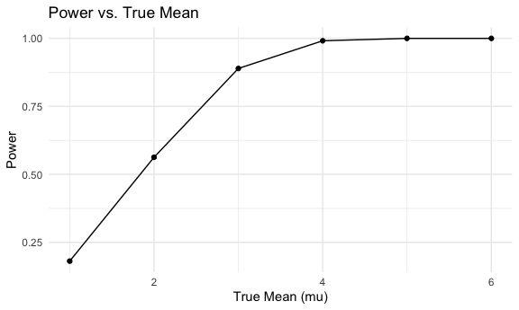

p8105_hw5_ah4167
================
Aiying Huang
2023-11-04

``` r
# Load necessary libraries
library(tidyverse)
library(rvest)
```

    ## 
    ## Attaching package: 'rvest'

    ## The following object is masked from 'package:readr':
    ## 
    ##     guess_encoding

``` r
library(purrr)
```

# problem1

For this problem, we are interested in data gathered and made public by
*The Washington Post* on homicides in 50 large U.S. cities. The code
chunk below imports and cleans the data.

``` r
homicide_df <- read_csv("./data/raw.githubusercontent.com_washingtonpost_data-homicides_master_homicide-data.csv", na = c("", "NA", "Unknown"))|>
  mutate(
    city_state = str_c(city, state, sep = ", "),
    resolution = case_when(
      disposition == "Closed without arrest" ~ "unsolved",
      disposition == "Open/No arrest"        ~ "unsolved",
      disposition == "Closed by arrest"      ~ "solved"
    )
  ) |>
  filter(city_state != "Tulsa, AL") 
```

    ## Rows: 52179 Columns: 12
    ## ── Column specification ────────────────────────────────────────────────────────
    ## Delimiter: ","
    ## chr (8): uid, victim_last, victim_first, victim_race, victim_sex, city, stat...
    ## dbl (4): reported_date, victim_age, lat, lon
    ## 
    ## ℹ Use `spec()` to retrieve the full column specification for this data.
    ## ℹ Specify the column types or set `show_col_types = FALSE` to quiet this message.

The resulting dataframe has 52178 entries, on variables that include the
victim name, race, age, and sex; the date the homicide was reported; and
the location of the homicide. In cleaning, I created a `city_state`
variable that includes both city and state, and a `resolution` variable
to indicate whether the case was closed by arrest. I also excluded one
entry in Tulsa, AL, which is not a major US city and is most likely a
data entry error.

In the next code chunk, I group within cities and summarize to produce
the total number of homicides and the number that are solved.

``` r
city_homicide_df = 
  homicide_df %>% 
  select(city_state, disposition, resolution) %>% 
  group_by(city_state) %>% 
  summarize(
    hom_total = n(),
    hom_unsolved = sum(resolution == "unsolved"))
```

Focusing only on Baltimore, MD, I can use the `prop.test` and
`broom::tidy` functions to obtain an estimate and CI of the proportion
of unsolved homicides in that city. The table below shows those values.

``` r
bmore_test = 
  prop.test(
    x = filter(city_homicide_df, city_state == "Baltimore, MD") %>% pull(hom_unsolved),
    n = filter(city_homicide_df, city_state == "Baltimore, MD") %>% pull(hom_total)) 

broom::tidy(bmore_test) %>% 
  knitr::kable(digits = 3)
```

| estimate | statistic | p.value | parameter | conf.low | conf.high | method                                               | alternative |
|---------:|----------:|--------:|----------:|---------:|----------:|:-----------------------------------------------------|:------------|
|    0.646 |   239.011 |       0 |         1 |    0.628 |     0.663 | 1-sample proportions test with continuity correction | two.sided   |

Building on this code, I can use functions in the `purrr` package to
obtain estimates and CIs for the proportion of unsolved homicides in
each city in my dataset. The code below implements this analysis.

``` r
test_results = 
  city_homicide_df %>% 
  mutate(
    prop_tests = map2(hom_unsolved, hom_total, \(x, y) prop.test(x = x, n = y)),
    tidy_tests = map(prop_tests, broom::tidy)) %>% 
  select(-prop_tests) %>% 
  unnest(tidy_tests) %>% 
  select(city_state, estimate, conf.low, conf.high) %>% 
  mutate(city_state = fct_reorder(city_state, estimate))
```

Finally, I make a plot showing the estimate (and CI) of the proportion
of unsolved homicides in each city.

``` r
test_results %>% 
  mutate(city_state = fct_reorder(city_state, estimate)) %>% 
  ggplot(aes(x = city_state, y = estimate)) + 
  geom_point() + 
  geom_errorbar(aes(ymin = conf.low, ymax = conf.high)) + 
  theme(axis.text.x = element_text(angle = 90, hjust = 1))
```


This figure suggests a very wide range in the rate at which homicides
are solved – Chicago is noticeably high and, given the narrowness of the
CI, likely is the location of many homicides.

# Problem2

``` r
# Create a dataframe containing all file names
file_paths <- list.files(path = "./data/hw5_data", full.names = TRUE, pattern = "\\.csv$")
```

``` r
# Iterate over file names and read in data
df=
  expand_grid(
    names=file_paths
  )|>
  mutate(result=map(names,read.csv))|>
  mutate(
    names=str_replace(names, "./data/hw5_data/", "")
    )
```

``` r
# Tidy the result
tidy_data =
  df |>
  mutate(
    subject_ID = str_extract(names,"\\d+"), # Extracts numbers from the filename
    arm = if_else(str_detect(names, "con"), "control", "experimental"),
    names = NULL # Remove the file_name column, no longer needed
  ) |>
  select(subject_ID,arm,result)|>
  unnest(result)|>
  tidyr::pivot_longer(
    week_1:week_8,
    names_to="week",
    values_to="observation"
  )|>
  mutate(week=as.numeric(str_extract(week,"\\d+")))
```

``` r
# Make a spaghetti plot
tidy_data|>
  group_by(subject_ID)|>
  ggplot(
    aes(x=week,y=observation,color=subject_ID)
  )+
  geom_line()+
  facet_wrap(~arm)+
  labs(
    title = "Observations Over Time by Subject",
    x = "Week",
    y = "Observation",
    color = "subject"
  )
```


We can see from the spaghetti plots above that the values of
observations in the experimental group increased over time, while they
remained relatively stable around their initial values in the control
group.

# Problem3

``` r
# Set parameters
n = 30 # Sample size
sigma = 5 # Standard deviation
mu = 0 # Population mean
alpha = 0.05 # Significance level
num_datasets = 5000 # Number of datasets

# Function to perform t-test on a single dataset
perform_t_test = function(mu=0, n=30, sigma=5) {
  sample_data = rnorm(n, mean = mu, sd = sigma)
  test_result = t.test(sample_data, mu = 0)
  broom::tidy(test_result)
}

# Simulate datasets and perform t-tests
simulated_tests = 
  replicate(
    num_datasets, 
    perform_t_test(mu, n, sigma), 
    simplify = FALSE)
simulated_tests_df =bind_rows(simulated_tests)

# Add identification for each simulation
simulated_tests_df = 
  simulated_tests_df |>
  mutate(simulation = row_number())

# Display a summary of the simulation results
head(simulated_tests_df)
```

    ## # A tibble: 6 × 9
    ##   estimate statistic p.value parameter conf.low conf.high method     alternative
    ##      <dbl>     <dbl>   <dbl>     <dbl>    <dbl>     <dbl> <chr>      <chr>      
    ## 1   -0.231    -0.296   0.769        29    -1.83     1.36  One Sampl… two.sided  
    ## 2    0.462     0.524   0.604        29    -1.34     2.27  One Sampl… two.sided  
    ## 3    0.311     0.327   0.746        29    -1.63     2.25  One Sampl… two.sided  
    ## 4   -1.21     -1.48    0.150        29    -2.89     0.465 One Sampl… two.sided  
    ## 5   -0.714    -0.794   0.434        29    -2.55     1.13  One Sampl… two.sided  
    ## 6   -0.558    -0.637   0.529        29    -2.35     1.24  One Sampl… two.sided  
    ## # ℹ 1 more variable: simulation <int>

``` r
# Set parameters
n = 30 # Sample size
sigma = 5 # Standard deviation
mu_values = 1:6
alpha = 0.05 # Significance level
num_datasets = 5000 # Number of datasets

# Function to perform t-test on a single dataset
perform_t_test = function(mu, n=30, sigma=5) {
  sample_data = rnorm(n, mean = mu, sd = sigma)
  test_result = t.test(sample_data, mu = 0)
  broom::tidy(test_result)
}

# Run simulation for multiple values of mu
simulation_results=
  map(mu_values, 
      function(mu) {
        t_tests = replicate(num_datasets, perform_t_test(mu, n, sigma), simplify = FALSE)
        t_tests_df = bind_rows(t_tests) |>
          add_column(mu = mu, .before = 1) |>
          mutate(rejected = p.value < alpha)
        t_tests_df
}) |> 
  bind_rows()

# Calculate the power for each value of mu
power_df =
  simulation_results |> 
  group_by(mu) |>
  summarise(power = mean(rejected))

# Calculate the average estimate of mu_hat
mu_hat_df =
  simulation_results |>
  group_by(mu) |>
  summarise(avg_mu_hat = mean(estimate))

# Calculate the average estimate of mu_hat where the null was rejected
mu_hat_rejected_df =
  simulation_results |> 
  filter(rejected) |>
  group_by(mu) |>
  summarise(avg_mu_hat_rejected = mean(estimate))
```

``` r
# Plot the power vs. true value of mu
ggplot(power_df, aes(x = mu, y = power)) +
  geom_point() +
  geom_line() +
  labs(x = "True Mean (mu)", y = "Power", title = "Power vs. True Mean")
```



The first plot shows the power of the test across different true means,
we can see that power increases with the true mean because larger effect
sizes are easier to detect.

``` r
combined_estimates <- left_join(mu_hat_df, mu_hat_rejected_df, by = "mu")
# Plot the power vs. true value of mu
combined_estimates|>
  pivot_longer(
    avg_mu_hat:avg_mu_hat_rejected,
    names_to="test",
    values_to="avg_mu"
  )|>
  mutate(
    test=case_match(
      test,
      "avg_mu_hat"~"fail_to_reject",
      "avg_mu_hat_rejected"~"reject"
    )
  )|>
  group_by(mu)|>
  ggplot(aes(x = mu,y=avg_mu,color=test)) +
  geom_point()+
  geom_line() +
  labs(x = "True Mean", y = "Average Estimated Mean)",
       title = "Comparison of Average Estimates vs. True Mean") +
  theme_minimal()
```


The second plot shows the average estimated mean versus the true mean,
with an overlay of the average estimated mean when the null hypothesis
was rejected. We observed that the average estimated mean is biased
upwards when considering only those tests where the null was rejected, a
phenomenon known as “winner’s curse” in statistics, where estimates
following a significant result tend to overestimate the true effect size
due to the selection of only significant outcomes.
